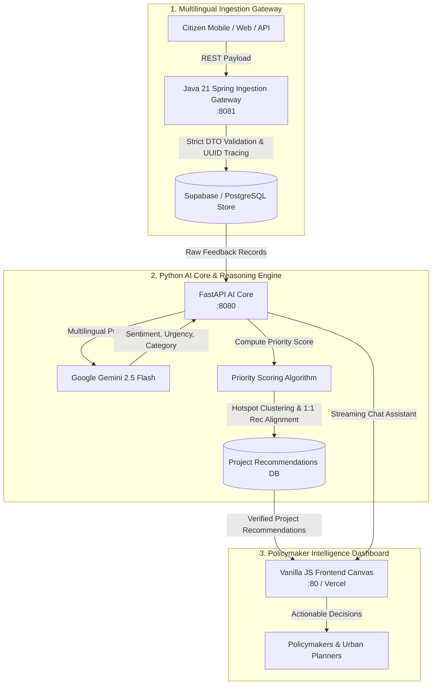

# 🏛️ NagarikBRICS — Digital Public Good Infrastructure Intelligence Platform

<p align="center">
  <strong>Transforming Multilingual Citizen Voices into High-Impact, SDG-Aligned Infrastructure Projects Across BRICS Nations.</strong>
</p>

<p align="center">
  <a href="https://github.com/Kishan-shah12/nagarik-brics"></a>
  <a href="https://nagarik-python-ai-core.onrender.com/health"></a>
  <a href="https://ai.google.dev/"></a>
  <a href="https://www.w3.org/WAI/standards-guidelines/wcag/"></a>
</p>

<p align="center">
  
  
  
  
  
  
  
</p>

---

## 📌 Table of Contents

- [Executive Summary & Problem Statement](#-executive-summary--problem-statement)
- [Key Capabilities & Innovations](#-key-capabilities--innovations)
- [System Architecture & Data Flow](#-system-architecture--data-flow)
- [Priority Scoring Formula](#-priority-scoring-formula)
- [Polyglot Microservices](#-polyglot-microservices)
- [Live Deployments & Endpoints](#-live-deployments--endpoints)
- [Getting Started & Local Execution](#-getting-started--local-execution)
- [Automated Testing & Security Hardening](#-automated-testing--security-hardening)
- [Project Structure](#-project-structure)
- [United Nations SDG Alignment](#-united-nations-sdg-alignment)

---

## 🌟 Executive Summary & Problem Statement

### The Problem
Across emerging economies and BRICS nations (*Brazil, Russia, India, China, South Africa*), public infrastructure capital is frequently misallocated:
- **30–40% of infrastructure funds** in developing nations fail to address the most urgent ground-level demands due to reliance on outdated, static census figures and top-down heuristics.
- **Multilingual Fragmentation**: Citizen complaints and community reports are scattered across 50+ languages, informal messaging networks, and disparate civic portals without a unified ingestion standard.
- **Disconnected Data**: Macro indicators (Human Development Index, SDG indices) operate at the national level and remain disconnected from hyperlocal infrastructure breakdowns.

### The Solution: NagarikBRICS
**Nagarik** (*"Citizen"* in Sanskrit and Hindi) **BRICS** is an open-source **Digital Public Good (DPG)** platform that bridges this gap. It captures unstructured citizen feedback in any language, classifies urgency and infrastructure deficits using Google Gemini 2.5 Flash, correlates findings with regional development indices, and delivers **actionable, budget-estimated infrastructure project recommendations** directly to policymakers.

```
┌─────────────────────────┐      ┌─────────────────────────┐      ┌─────────────────────────┐
│  Citizen Pain Points    │ ───▶ │  AI Intelligence Engine │ ───▶ │  Policymaker Action     │
│  (Multilingual Voice /  │      │  (Gemini 2.5 + Priority │      │  (1:1 Project Recs +    │
│   Text Feedback)        │      │   Scoring Formula)      │      │   Budget Estimates)     │
└─────────────────────────┘      └─────────────────────────┘      └─────────────────────────┘
```

---

## 🚀 Key Capabilities & Innovations

- 🌐 **Multilingual Ingestion Gateway**: Ingests citizen feedback across Hindi, Portuguese, Russian, Mandarin, and English with zero-shot linguistic understanding.
- 🧠 **Zero-Local-Model AI Core**: Powered by **Google Gemini 2.5 Flash** for rapid translation, sentiment polarity detection (`-1.0` to `+1.0`), and urgency scoring (`1.0` to `10.0`).
- 🎯 **Guaranteed 1:1 Citizen-to-Project Alignment**: Rigorous deduplication engine ensures each citizen grievance translates to exactly one high-impact, verified project recommendation, eliminating duplicate proposals on page refresh.
- 🗺️ **Geospatial Hotspot Analysis**: Automated spatial clustering identifies geographic clusters of severe infrastructure failure.
- 💰 **Dual-Currency Budget Estimation**: Automatically calculates accurate local currency outlays (INR, BRL, RUB, CNY, ZAR) alongside normalized USD estimates.
- 📊 **Lightweight Zero-Bloat Canvas**: 100% Vanilla HTML5/CSS3/ES6 interactive visualization without heavy mapping dependencies, running smoothly in low-bandwidth regions.
- 💬 **Interactive Policymaker AI Copilot**: Built-in conversational AI assistant providing immediate policy context, historical query answers, and recommendations.

---

## 🏗️ System Architecture & Data Flow



---

## 📐 Priority Scoring Formula

To eliminate subjective human bias and prioritize infrastructure investments where need is highest, NagarikBRICS computes a transparent **Composite Priority Score (0–100)**:

$$\text{Priority Score} = 0.40 \cdot U + 0.25 \cdot V + 0.25 \cdot G + 0.10 \cdot S$$

| Component | Weight | Metric Range | Description |
| :--- | :---: | :---: | :--- |
| **Citizen Urgency ($U$)** | **40%** | `0 – 10` | Real-time severity extracted from citizen language by Gemini NLP. |
| **Feedback Volume ($V$)** | **25%** | `1 – N` | Logarithmically scaled cluster density of reports in the region. |
| **Infrastructure Index Gap ($G$)** | **25%** | `0 – 100%` | Deficit between regional HDI/SDG score and the national baseline. |
| **Sentiment Severity ($S$)** | **10%** | `-1.0 – +1.0` | Negative sentiment magnitude reflecting social distress. |

---

## 🧩 Polyglot Microservices

```
Build with Ai/
├── services/
│   ├── java-ingestion/          # Java 21 LTS + Spring Boot 3.3.2 Data Ingestion Gateway
│   │   ├── src/main/java/       # Aggressive input validation, Jackson, UUID v4 tracing
│   │   └── Dockerfile           # Multi-stage non-root container build (Alpine JRE)
│   ├── python-ai-core/          # Python 3.11 + FastAPI + Google GenAI SDK
│   │   ├── app/gemini_service.py# NLP pipeline, Hotspot clusterer & 1:1 recommendation engine
│   │   ├── app/schemas.py       # Pydantic v2 strict data contracts
│   │   └── Dockerfile           # Multi-stage slim container execution
│   └── frontend-ui/             # Policymaker Intelligence Dashboard
│       ├── index.html           # Semantic HTML5 (WCAG 2.1 AA compliant)
│       ├── css/style.css        # Clean, dark-mode glassmorphic styling
│       ├── js/app.js            # Vanilla ES6 client orchestration & deduplication
│       └── js/security.js       # Deep-frozen configs & entity-encoded XSS defense
├── api/index.py                 # Vercel Serverless Python Assistant endpoint
├── docker-compose.yml           # Unified multi-service orchestration
└── render.yaml                  # Automated cloud deployment specification
```

---

## 🌐 Live Deployments & Endpoints

| Service | Environment | URL / Endpoint | Status |
| :--- | :--- | :--- | :---: |
| **Python AI Core API** | Render Cloud | `https://nagarik-python-ai-core.onrender.com` |  |
| **Health Check** | Render Cloud | `GET /health` | `HTTP 200` |
| **Hotspot Analysis** | Render Cloud | `POST /api/v1/ai/analyze-hotspots` | `Active` |
| **Recommendations** | Render Cloud | `GET /api/v1/ai/recommendations` | `Active (1:1)` |
| **Java Ingestion** | Render Cloud | `https://nagarik-java-ingestion.onrender.com` |  |
| **AI Chat Copilot** | Vercel Serverless | `/api/chat` | `Active` |

### Sample API Request: Hotspot Analysis

```bash
curl -X POST "https://nagarik-python-ai-core.onrender.com/api/v1/ai/analyze-hotspots" \
  -H "Content-Type: application/json" \
  -d '{
    "filters": {
      "country_code": "IN"
    }
  }'
```

---

## 💻 Getting Started & Local Execution

### Prerequisites
- [Docker](https://www.docker.com/) & Docker Compose (v2.0+)
- [Google Gemini API Key](https://aistudio.google.com/)

### 1. Clone & Configure
```bash
git clone https://github.com/Kishan-shah12/nagarik-brics.git
cd nagarik-brics
```

Create a `.env` file in the root directory:
```env
GEMINI_API_KEY="your-google-gemini-api-key"
SUPABASE_URL="your-supabase-url"
SUPABASE_SERVICE_ROLE_KEY="your-supabase-service-key"
```

### 2. Launch with Docker Compose
```bash
docker compose up --build -d
```
All three microservices will start with strict health checks:
- **Frontend Dashboard**: `http://localhost`
- **Python AI Core API**: `http://localhost:8080/docs` (Swagger UI)
- **Java Ingestion API**: `http://localhost:8081`

---

## 🛡️ Automated Testing & Security Hardening

NagarikBRICS enforces enterprise-grade security standards across every tier:

- 🔒 **Content Security Policy (CSP)**: Strict meta headers restricting execution origins.
- 🛡️ **Zero-Trust XSS Protection**: Deep entity mapping (`&`, `<`, `>`, `"`, `'`) for all citizen text rendered in the DOM.
- 🧊 **Tamper-Proof Configs**: Frontend configuration objects are deeply frozen via `Object.freeze()` to prevent prototype pollution.
- 👤 **Non-Root Containers**: Every Docker image explicitly creates and switches to a dedicated unprivileged user (`appuser` / `nginx`).

### Run Automated Security Test Suite
```bash
node services/frontend-ui/tests/test_runner.js
```

```text
=========================================
STARTING AUTOMATED SECURITY & E2E TESTS
=========================================

--- Testing XSS Sanitization ---
[PASS] sanitizeHTML escapes < > " ' &
[PASS] sanitizeHTML output matches entity map
[PASS] sanitizeURL strips javascript: protocol
[PASS] sanitizeURL preserves https: protocol

--- Testing Prototype Defenses ---
[PASS] CONFIG object is deeply frozen

--- Testing Schema Logic (Client Side) ---
[PASS] Rejects feedback text < 10 chars
[PASS] Accepts feedback text 10+ chars

--- Testing Inter-Service Contracts ---
[PASS] InternalProcessRequest payload meets Python schema validation

=========================================
TEST SUMMARY: 8 Passed, 0 Failed
=========================================
```

---

## 🎯 United Nations SDG Alignment

Every project recommendation produced by NagarikBRICS maps directly to the UN Sustainable Development Goals:

- **SDG 3: Good Health and Well-Being** — Rural mobile clinics, primary health center electrification.
- **SDG 6: Clean Water and Sanitation** — Decentralized wastewater treatment, potable water kiosks.
- **SDG 9: Industry, Innovation, and Infrastructure** — Climate-resilient bridges, road network modernization.
- **SDG 11: Sustainable Cities and Communities** — Urban drainage, public asset maintenance systems.

---

## 📄 License & Attribution

Designed and engineered for **Build with AI** as an open Digital Public Good (DPG). Released under the [MIT License](LICENSE).
