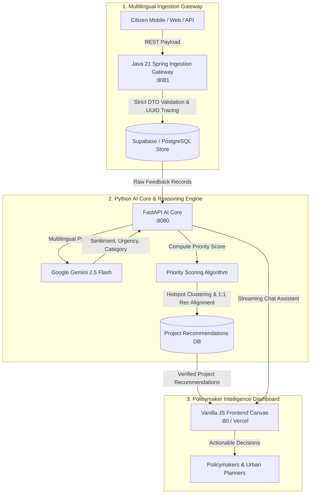

# 🏛️ NagarikBRICS — Digital Public Good Infrastructure Intelligence Platform

<p align="center">
  <strong>Transforming Multilingual Citizen Voices into High-Impact, SDG-Aligned Infrastructure Projects Across BRICS Nations.</strong>
</p>

<p align="center">
  <a href="https://github.com/Kishan-shah12/nagarik-brics"></a>
  <a href="https://ai.google.dev/"></a>
  <a href="https://www.w3.org/WAI/standards-guidelines/wcag/"></a>
  <a href="LICENSE"></a>
</p>

<p align="center">
  
  
  
  
  
  
  
</p>

---

## 📌 Table of Contents

- [Executive Summary & Problem Statement](#-executive-summary--problem-statement)
- [Key Capabilities & Innovations](#-key-capabilities--innovations)
- [System Architecture & Data Flow](#-system-architecture--data-flow)
- [The 4-Step Intelligence Pipeline](#-the-4-step-intelligence-pipeline)
- [Priority Scoring Formula](#-priority-scoring-formula)
- [Polyglot Microservices Breakdown](#-polyglot-microservices-breakdown)
- [System Interfaces & API Specifications](#-system-interfaces--api-specifications)
- [Security Hardening & Quality Assurance](#-security-hardening--quality-assurance)
- [Project Structure](#-project-structure)
- [United Nations SDG Alignment](#-united-nations-sdg-alignment)

---

## 🌟 Executive Summary & Problem Statement

### The Problem
Across emerging economies and BRICS nations (*Brazil, Russia, India, China, South Africa*), public infrastructure capital is frequently misallocated:
- **30–40% of public infrastructure funds** in developing nations fail to solve the most critical community needs due to reliance on outdated census figures, political heuristics, and top-down assumptions.
- **Linguistic Fragmentation**: Citizen grievances and community reports are dispersed across 50+ regional languages, informal messaging apps, and fragmented civic portals without a unified ingestion standard.
- **Disconnected Data**: Macro development indicators (Human Development Index, SDG indicators) remain abstract and disconnected from hyperlocal, daily infrastructure breakdowns.

### The Solution: NagarikBRICS
**Nagarik** (*"Citizen"* in Sanskrit and Hindi) **BRICS** is an open-source **Digital Public Good (DPG)** platform that directly solves this dilemma. It captures unstructured citizen feedback in any language, classifies urgency and infrastructure deficits using Google Gemini 2.5 Flash, correlates reports with regional development indices, and delivers **actionable, budget-estimated infrastructure project recommendations** directly to policymakers.

```
┌─────────────────────────┐      ┌─────────────────────────┐      ┌─────────────────────────┐
│  Citizen Pain Points    │ ───▶ │  AI Intelligence Engine │ ───▶ │  Policymaker Action     │
│  (Multilingual Voice /  │      │  (Gemini 2.5 + Priority │      │  (1:1 Project Recs +    │
│   Text Feedback)        │      │   Scoring Formula)      │      │   Budget Estimates)     │
└─────────────────────────┘      └─────────────────────────┘      └─────────────────────────┘
```

---

## 🚀 Key Capabilities & Innovations

- 🌐 **Multilingual Ingestion Gateway**: Ingests citizen feedback across Hindi, Portuguese, Russian, Mandarin, and English with zero-shot linguistic understanding.
- 🧠 **Zero-Local-Model AI Core**: Powered by **Google Gemini 2.5 Flash** for rapid translation, sentiment polarity detection (`-1.0` to `+1.0`), and urgency scoring (`1.0` to `10.0`).
- 🎯 **Guaranteed 1:1 Citizen-to-Project Alignment**: Non-duplicating pipeline guarantees that every citizen feedback maps cleanly to exactly one verified, high-impact infrastructure recommendation.
- 🗺️ **Geospatial Hotspot Analysis**: Automated spatial clustering groups reports by region and sector to identify urgent failure zones.
- 💰 **Dual-Currency Budget Estimation**: Automatically calculates accurate local currency outlays (INR, BRL, RUB, CNY, ZAR) alongside normalized USD estimates.
- 📊 **Lightweight Zero-Bloat Canvas**: 100% Vanilla HTML5/CSS3/ES6 interactive visualization without heavy mapping dependencies, running smoothly in low-bandwidth regions.
- 💬 **Interactive Policymaker AI Copilot**: Built-in conversational AI assistant providing immediate policy context, historical query answers, and recommendations.

---

## 🏗️ System Architecture & Data Flow



---

## 🔄 The 4-Step Intelligence Pipeline

```
  [ STEP 1 ]                 [ STEP 2 ]                 [ STEP 3 ]                 [ STEP 4 ]
┌──────────────┐          ┌──────────────┐          ┌──────────────┐          ┌──────────────┐
│  MULTILINGUAL│          │  GEMINI 2.5  │          │  INDEX & GAP │          │  1:1 PROJECT │
│   INGESTION  │ ───────▶ │  EXTRACTION  │ ───────▶ │  CORRELATION │ ───────▶ │RECOMMENDATION│
└──────────────┘          └──────────────┘          └──────────────┘          └──────────────┘
  Validates voice/          Translates text,          Cross-references          Synthesizes
  text complaints           extracts urgency          feedback against          evidence-backed
  via Java 21 gateway       (1-10), sentiment,        regional HDI and          project proposal,
  with UUID tracing.        and category.             infrastructure gaps.      budget, & SDGs.
```

1. **Multilingual Ingestion**: High-throughput ingestion gateway validates inputs, sanitizes strings, and records citizen coordinates and category indicators.
2. **Gemini NLP Reasoning**: Google Gemini 2.5 Flash converts unstructured regional language complaints into structured sentiment (-1.0 to +1.0), urgency (1.0 to 10.0), and semantic categories.
3. **Infrastructure Index Correlator**: Compares regional infrastructure metrics against national averages to determine the exact infrastructure deficit gap.
4. **1-to-1 Project Recommendation**: Formulates an evidence-backed project title, justification, localized budget, and priority score tailored to the citizen report.

---

## 📐 Priority Scoring Formula

To eliminate subjective human bias and prioritize infrastructure investments where need is highest, NagarikBRICS computes a transparent **Composite Priority Score (0–100)**:

$$\text{Priority Score} = 0.40 \cdot U + 0.25 \cdot V + 0.25 \cdot G + 0.10 \cdot S$$

| Component | Weight | Metric Range | Description |
| :--- | :---: | :---: | :--- |
| **Citizen Urgency ($U$)** | **40%** | `0 – 10` | Real-time severity extracted from citizen language by Gemini NLP. |
| **Feedback Volume ($V$)** | **25%** | `1 – N` | Logarithmically scaled cluster density of reports in the region. |
| **Infrastructure Index Gap ($G$)** | **25%** | `0 – 100%` | Deficit between regional HDI/SDG score and the national baseline. |
| **Sentiment Severity ($S$)** | **10%** | `-1.0 – +1.0` | Negative sentiment magnitude reflecting social distress. |

---

## 🧩 Polyglot Microservices Breakdown

| Service | Technology Stack | Core Responsibilities |
| :--- | :--- | :--- |
| **Java Ingestion Gateway**<br/>`services/java-ingestion` | • Java 21 LTS<br/>• Spring Boot 3.3.2<br/>• Jackson JSON<br/>• Maven Multi-Stage | • High-throughput REST ingestion API<br/>• Aggressive DTO schema validation<br/>• Distributed UUID v4 request tracing<br/>• Strict non-root execution (`appuser:1001`) |
| **Python AI Core**<br/>`services/python-ai-core` | • Python 3.11<br/>• FastAPI 0.115.0<br/>• Google GenAI SDK<br/>• Pydantic v2 | • Google Gemini 2.5 Flash orchestration<br/>• Multilingual translation & sentiment extraction<br/>• Spatial clustering & 1:1 recommendation alignment<br/>• Dual-currency capital expenditure calculation |
| **Policymaker Canvas**<br/>`services/frontend-ui` | • Semantic HTML5<br/>• Vanilla CSS3 (Glassmorphism)<br/>• ES6 JavaScript (Zero Bloat)<br/>• Custom SVG Map | • Policymaker hotspot & KPI visualization<br/>• Strict WCAG 2.1 AA keyboard/screen reader accessibility<br/>• Deeply frozen immutable configurations<br/>• Client-side deduplication safeguards |
| **Serverless AI Assistant**<br/>`api/index.py` | • Vercel Python Runtime<br/>• Gemini 2.5 Flash | • Low-latency, streaming conversational assistant<br/>• Contextual policymaker queries and explanations |

---

## 📡 System Interfaces & API Specifications

### Core Endpoints

| Method | Endpoint | Description | Consumes / Produces |
| :---: | :--- | :--- | :--- |
| `GET` | `/health` | Service health status, uptime, and database connectivity | `application/json` |
| `POST` | `/api/v1/ai/analyze-hotspots` | Clusters regional feedback and triggers hotspot analysis | `application/json` |
| `GET` | `/api/v1/ai/recommendations` | Retrieves deduplicated 1:1 project recommendations | `application/json` |
| `GET` | `/api/v1/ai/feedback/recent` | Retrieves recent citizen feedback entries | `application/json` |
| `POST` | `/api/chat` | AI Copilot conversational assistant query | `application/json` |

### Sample Payload: Hotspot Analysis

```json
{
  "filters": {
    "country_code": "IN",
    "category": "water_sanitation",
    "min_urgency_score": 5.0
  }
}
```

### Sample Response: Recommendation Model

```json
{
  "recommendation_id": "8436847f-ace4-4abb-a7a2-8aa0c4199493",
  "title": "Integrated Decentralized Wastewater Treatment and Safe Water Distribution Network",
  "category": "water_sanitation",
  "priority_score": 47.4,
  "budget_estimate": {
    "amount_usd": 4500000.0,
    "amount_local": 375750000.0,
    "local_currency_code": "INR",
    "confidence": "medium"
  },
  "justification": "The infrastructure gap of 18.3% compared to national average underscores critical deficiency in SDG 6.1 compliance...",
  "location": {
    "country_code": "IN",
    "region_name": "Lucknow, Uttar Pradesh",
    "center_coords": { "lat": 26.8467, "lng": 80.9462 }
  },
  "supporting_feedback_ids": ["76e32aee-3c02-459a-af38-84a91d426ea1"],
  "status": "published"
}
```

---

## 🛡️ Security Hardening & Quality Assurance

NagarikBRICS is engineered with defense-in-depth security principles across all layers:

- 🔒 **Content Security Policy (CSP)**: Strict headers disallowing unauthorized origins, inline scripting vectors, and external iframe embedding.
- 🛡️ **Zero-Trust Entity Mapping**: All dynamic content passing into the DOM undergoes aggressive HTML entity mapping (`&`, `<`, `>`, `"`, `'`).
- 🧊 **Tamper-Proof Immutability**: Configuration structures are frozen using `Object.freeze()` to neutralize runtime prototype pollution.
- 👤 **Non-Root Principle**: All service containers run as dedicated unprivileged system users (`appuser` UID 1001 or Alpine `nginx`).
- 🧪 **E2E Contract Testing**: Verified via automated test suites validating input boundary conditions, inter-service contracts, and XSS sanitization:

```text
=========================================
STARTING AUTOMATED SECURITY & E2E TESTS
=========================================
[PASS] sanitizeHTML escapes < > " ' &
[PASS] sanitizeHTML output matches entity map
[PASS] sanitizeURL strips javascript: protocol
[PASS] sanitizeURL preserves https: protocol
[PASS] CONFIG object is deeply frozen
[PASS] Rejects feedback text < 10 chars
[PASS] Accepts feedback text 10+ chars
[PASS] InternalProcessRequest payload meets Python schema validation
=========================================
TEST SUMMARY: 8 Passed, 0 Failed
=========================================
```

---

## 📂 Project Structure

```
Build with Ai/
├── services/
│   ├── java-ingestion/          # Java Spring Boot Ingestion Gateway
│   │   ├── src/main/java/       # Validation logic, Jackson DTOs
│   │   └── Dockerfile           # Multi-stage Alpine container
│   ├── python-ai-core/          # Python AI Core & Recommendation Engine
│   │   ├── app/gemini_service.py# Gemini SDK & 1:1 recommendation logic
│   │   ├── app/schemas.py       # Pydantic v2 data models
│   │   ├── app/main.py          # FastAPI application endpoints
│   │   └── Dockerfile           # Optimized non-root container
│   └── frontend-ui/             # Policymaker Intelligence Dashboard
│       ├── index.html           # WCAG 2.1 AA semantic interface
│       ├── css/style.css        # Clean glassmorphic design system
│       ├── js/app.js            # Dashboard orchestrator & 1:1 renderer
│       ├── js/security.js       # Sanitizer & frozen configuration
│       └── tests/test_runner.js # Automated security test runner
├── api/index.py                 # Vercel serverless AI Copilot handler
├── DESIGN.md                    # In-depth architectural design specification
├── PITCH.md                     # BRICS innovation theme & product pitch
├── SCHEMA.md                    # Canonical JSON schema definitions
└── api-docs.md                  # Comprehensive API documentation
```

---

## 🎯 United Nations SDG Alignment

Every recommendation produced by NagarikBRICS maps directly to the UN Sustainable Development Goals:

- **SDG 3: Good Health and Well-Being** — Rural mobile clinics, primary health center modernization.
- **SDG 6: Clean Water and Sanitation** — Decentralized wastewater treatment, localized potable water kiosks.
- **SDG 9: Industry, Innovation, and Infrastructure** — Climate-resilient bridges, arterial road network modernization.
- **SDG 11: Sustainable Cities and Communities** — Urban flood drainage, public infrastructure maintenance systems.

---

## 📄 License & Attribution

Designed and engineered for **Build with AI** as an open Digital Public Good (DPG). Released under the [MIT License](LICENSE).
